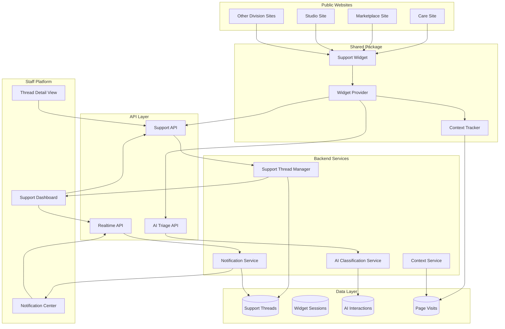
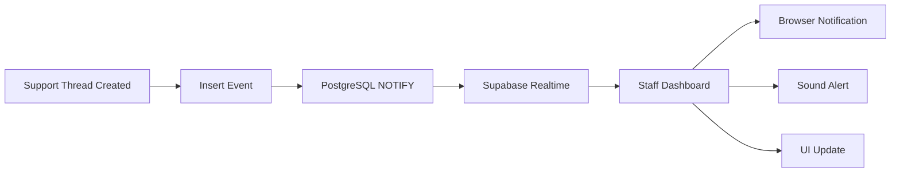

# HenryCo Support Platform Design

## Overview

The HenryCo Support Platform extends the existing Care support system into a unified, cross-division customer support experience. The platform provides a floating support widget accessible across all HenryCo public websites, AI-assisted triage for first-line support, realtime staff notifications, and comprehensive page context tracking.

### Design Goals

1. **Unified Experience**: Single support interface across all HenryCo divisions
2. **Leverage Existing Infrastructure**: Build on the proven Care support backend
3. **AI-First Triage**: Deflect routine inquiries while preserving human escalation
4. **Realtime Operations**: Live notifications for support staff
5. **Context-Aware**: Capture user journey and page context automatically
6. **Premium UX**: Maintain HenryCo's high design standards across all touchpoints
7. **Mobile-Optimized**: Touch-friendly, responsive, performant on all devices
8. **Accessible**: WCAG 2.1 AA compliant, keyboard navigable, screen reader friendly

### Key Capabilities

- Floating support widget with site-aware theming
- AI-powered intent classification and FAQ matching
- Clean escalation from AI to human support
- Realtime staff dashboard with live notifications
- Page context and user journey tracking
- Cross-division support routing
- Conversation persistence and resumption
- Mobile-optimized interface
- Comprehensive analytics and reporting

## Architecture

### System Components



### Data Flow

1. **Widget Initialization**
   - User visits any HenryCo website
   - Widget loads asynchronously with division-specific theme
   - Context tracker captures page URL, title, referrer, user session
   - Widget state persists across page navigation

2. **AI Triage Flow**
   - User opens widget and types message
   - AI classifies intent (FAQ, billing, booking, escalation)
   - AI suggests relevant FAQ articles or structured help
   - AI gathers additional context if needed
   - AI determines if escalation is required

3. **Escalation Flow**
   - User requests human support or AI determines escalation needed
   - System creates support thread in database
   - System captures full conversation history and page context
   - System routes to appropriate division support team
   - System notifies support staff via realtime channel
   - Customer receives thread reference number

4. **Staff Response Flow**
   - Support agent receives realtime notification
   - Agent views thread with full context in dashboard
   - Agent assigns thread to themselves
   - Agent replies via email/WhatsApp
   - Customer receives reply notification
   - Thread status updates in realtime

5. **Conversation Continuation**
   - Customer can resume conversation using thread reference
   - System loads conversation history
   - New messages append to existing thread
   - Staff receives notification of resumed thread

### Technology Stack

**Frontend**
- React 18+ (client components)
- TypeScript (type safety)
- Framer Motion (animations)
- TailwindCSS (styling)
- Zustand or React Context (state management)
- Lucide React (icons)

**Backend**
- Next.js API Routes (serverless functions)
- Supabase (database, realtime)
- OpenAI API (AI classification)
- Resend (email delivery)
- WhatsApp Business API (messaging)

**Infrastructure**
- Vercel (hosting, edge functions)
- Supabase Realtime (WebSocket alternative)
- Cloudinary (attachment storage)

## Components and Interfaces

### Shared Package Structure

```
packages/support/
├── components/
│   ├── SupportWidget.tsx          # Main floating widget
│   ├── SupportButton.tsx          # Floating button trigger
│   ├── SupportPanel.tsx           # Expanded chat panel
│   ├── SupportChat.tsx            # Chat interface
│   ├── SupportForm.tsx            # Quick contact form
│   ├── SupportMessage.tsx         # Message bubble
│   ├── SupportTyping.tsx          # Typing indicator
│   └── SupportHeader.tsx          # Widget header
├── hooks/
│   ├── useSupportWidget.ts        # Widget state management
│   ├── useSupportChat.ts          # Chat operations
│   ├── useSupportContext.ts       # Page context tracking
│   └── useSupportRealtime.ts     # Realtime subscriptions
├── lib/
│   ├── support-client.ts          # API client
│   ├── support-context.ts         # Context capture
│   ├── support-theme.ts           # Theme utilities
│   └── support-storage.ts         # Local storage
├── types/
│   └── index.ts                   # TypeScript types
└── index.ts                       # Package exports
```

### Component Specifications

#### SupportWidget

Main component that orchestrates the entire widget experience.

```typescript
interface SupportWidgetProps {
  division: DivisionKey;
  theme?: 'light' | 'dark' | 'auto';
  position?: 'bottom-right' | 'bottom-left';
  offset?: { x: number; y: number };
  zIndex?: number;
  initialOpen?: boolean;
  onOpen?: () => void;
  onClose?: () => void;
  onEscalate?: (threadRef: string) => void;
}
```

**Responsibilities:**
- Render floating button and panel
- Manage open/closed state
- Handle animations and transitions
- Apply division-specific theming
- Track widget interactions
- Persist state across navigation

#### SupportChat

Chat interface for AI and human conversations.

```typescript
interface SupportChatProps {
  division: DivisionKey;
  threadRef?: string | null;
  onEscalate?: (threadRef: string) => void;
  onClose?: () => void;
}

interface Message {
  id: string;
  role: 'user' | 'assistant' | 'system';
  content: string;
  timestamp: string;
  metadata?: {
    intent?: string;
    confidence?: number;
    suggestedFAQs?: FAQ[];
  };
}
```

**Responsibilities:**
- Display conversation history
- Handle user input
- Show typing indicators
- Render AI suggestions
- Display escalation options
- Show thread reference

#### SupportForm

Quick contact form for direct escalation.

```typescript
interface SupportFormProps {
  division: DivisionKey;
  prefill?: {
    subject?: string;
    message?: string;
    category?: string;
  };
  onSubmit?: (threadRef: string) => void;
  onCancel?: () => void;
}
```

**Responsibilities:**
- Collect customer information
- Validate form inputs
- Submit support thread
- Show success/error states
- Display thread reference

### API Endpoints

#### Support Thread API

```typescript
// POST /api/support/threads
interface CreateThreadRequest {
  division: DivisionKey;
  customerName: string;
  customerEmail: string;
  customerPhone?: string;
  preferredContactMethod: 'email' | 'phone' | 'whatsapp' | 'any';
  subject: string;
  message: string;
  serviceCategory: string;
  urgency: 'routine' | 'priority' | 'urgent';
  context: PageContext;
  conversationHistory?: Message[];
}

interface CreateThreadResponse {
  ok: boolean;
  threadRef: string;
  threadId: string;
  estimatedResponseTime: string;
}

// GET /api/support/threads/:threadRef
interface GetThreadResponse {
  ok: boolean;
  thread: SupportThread;
}

// POST /api/support/threads/:threadRef/messages
interface AddMessageRequest {
  message: string;
  attachments?: Attachment[];
}

interface AddMessageResponse {
  ok: boolean;
  messageId: string;
}
```

#### AI Triage API

```typescript
// POST /api/support/ai/classify
interface ClassifyIntentRequest {
  message: string;
  division: DivisionKey;
  context: PageContext;
  conversationHistory?: Message[];
}

interface ClassifyIntentResponse {
  ok: boolean;
  intent: 'faq' | 'billing' | 'booking' | 'technical' | 'escalation';
  confidence: number;
  suggestedFAQs?: FAQ[];
  suggestedResponse?: string;
  requiresEscalation: boolean;
  reason?: string;
}

// POST /api/support/ai/suggest
interface SuggestFAQRequest {
  query: string;
  division: DivisionKey;
  limit?: number;
}

interface SuggestFAQResponse {
  ok: boolean;
  faqs: FAQ[];
}
```

#### Realtime API

```typescript
// GET /api/support/realtime/subscribe
// Server-Sent Events endpoint for staff notifications

interface NotificationEvent {
  type: 'thread_created' | 'thread_updated' | 'message_received';
  threadId: string;
  threadRef: string;
  division: DivisionKey;
  urgency: string;
  preview: string;
  timestamp: string;
}
```

### Context Tracking

#### PageContext Interface

```typescript
interface PageContext {
  url: string;
  title: string;
  referrer: string;
  division: DivisionKey;
  userAgent: string;
  screenSize: { width: number; height: number };
  timestamp: string;
  sessionId: string;
  userId?: string;
  userEmail?: string;
  userRole?: string;
  journey: PageVisit[];
}

interface PageVisit {
  url: string;
  title: string;
  timestamp: string;
  duration: number;
}
```

**Context Capture Rules:**
- Capture on widget open
- Update on page navigation
- Track journey (last 10 pages)
- Respect privacy (no sensitive data)
- Include user info if authenticated
- Generate session ID for anonymous users

## Data Models

### Database Schema Extensions

#### support_widget_sessions

Tracks widget sessions for analytics and context.

```sql
CREATE TABLE support_widget_sessions (
  id UUID PRIMARY KEY DEFAULT gen_random_uuid(),
  session_id TEXT NOT NULL UNIQUE,
  division TEXT NOT NULL,
  user_id UUID REFERENCES profiles(id),
  started_at TIMESTAMPTZ NOT NULL DEFAULT NOW(),
  last_activity_at TIMESTAMPTZ NOT NULL DEFAULT NOW(),
  page_visits JSONB NOT NULL DEFAULT '[]',
  widget_opens INTEGER NOT NULL DEFAULT 0,
  messages_sent INTEGER NOT NULL DEFAULT 0,
  escalated BOOLEAN NOT NULL DEFAULT FALSE,
  thread_ref TEXT,
  user_agent TEXT,
  screen_size JSONB,
  created_at TIMESTAMPTZ NOT NULL DEFAULT NOW(),
  updated_at TIMESTAMPTZ NOT NULL DEFAULT NOW()
);

CREATE INDEX idx_support_widget_sessions_session_id ON support_widget_sessions(session_id);
CREATE INDEX idx_support_widget_sessions_user_id ON support_widget_sessions(user_id);
CREATE INDEX idx_support_widget_sessions_division ON support_widget_sessions(division);
CREATE INDEX idx_support_widget_sessions_started_at ON support_widget_sessions(started_at DESC);
```

#### support_ai_interactions

Tracks AI triage interactions for improvement.

```sql
CREATE TABLE support_ai_interactions (
  id UUID PRIMARY KEY DEFAULT gen_random_uuid(),
  session_id TEXT NOT NULL,
  thread_id UUID,
  division TEXT NOT NULL,
  user_message TEXT NOT NULL,
  ai_response TEXT,
  intent TEXT,
  confidence DECIMAL(3,2),
  suggested_faqs JSONB,
  escalated BOOLEAN NOT NULL DEFAULT FALSE,
  escalation_reason TEXT,
  helpful BOOLEAN,
  feedback TEXT,
  created_at TIMESTAMPTZ NOT NULL DEFAULT NOW()
);

CREATE INDEX idx_support_ai_interactions_session_id ON support_ai_interactions(session_id);
CREATE INDEX idx_support_ai_interactions_thread_id ON support_ai_interactions(thread_id);
CREATE INDEX idx_support_ai_interactions_division ON support_ai_interactions(division);
CREATE INDEX idx_support_ai_interactions_intent ON support_ai_interactions(intent);
CREATE INDEX idx_support_ai_interactions_created_at ON support_ai_interactions(created_at DESC);
```

#### support_page_visits

Tracks page visits for context and analytics.

```sql
CREATE TABLE support_page_visits (
  id UUID PRIMARY KEY DEFAULT gen_random_uuid(),
  session_id TEXT NOT NULL,
  thread_id UUID,
  url TEXT NOT NULL,
  title TEXT,
  referrer TEXT,
  division TEXT NOT NULL,
  user_id UUID REFERENCES profiles(id),
  visited_at TIMESTAMPTZ NOT NULL DEFAULT NOW(),
  duration_seconds INTEGER,
  created_at TIMESTAMPTZ NOT NULL DEFAULT NOW()
);

CREATE INDEX idx_support_page_visits_session_id ON support_page_visits(session_id);
CREATE INDEX idx_support_page_visits_thread_id ON support_page_visits(thread_id);
CREATE INDEX idx_support_page_visits_user_id ON support_page_visits(user_id);
CREATE INDEX idx_support_page_visits_division ON support_page_visits(division);
CREATE INDEX idx_support_page_visits_visited_at ON support_page_visits(visited_at DESC);
```

### Extending Existing Tables

The existing `care_security_logs` table will be extended to support cross-division events:

```sql
-- Add division column to existing table
ALTER TABLE care_security_logs ADD COLUMN IF NOT EXISTS division TEXT;
CREATE INDEX IF NOT EXISTS idx_care_security_logs_division ON care_security_logs(division);

-- New event types for cross-division support
-- support_widget_opened
-- support_ai_interaction
-- support_escalation_requested
-- support_thread_resumed
```

### TypeScript Types

```typescript
export type DivisionKey =
  | 'hub'
  | 'care'
  | 'building'
  | 'hotel'
  | 'marketplace'
  | 'property'
  | 'logistics'
  | 'studio'
  | 'jobs'
  | 'learn';

export interface WidgetSession {
  id: string;
  sessionId: string;
  division: DivisionKey;
  userId?: string;
  startedAt: string;
  lastActivityAt: string;
  pageVisits: PageVisit[];
  widgetOpens: number;
  messagesSent: number;
  escalated: boolean;
  threadRef?: string;
  userAgent: string;
  screenSize: { width: number; height: number };
}

export interface AIInteraction {
  id: string;
  sessionId: string;
  threadId?: string;
  division: DivisionKey;
  userMessage: string;
  aiResponse?: string;
  intent?: string;
  confidence?: number;
  suggestedFAQs?: FAQ[];
  escalated: boolean;
  escalationReason?: string;
  helpful?: boolean;
  feedback?: string;
  createdAt: string;
}

export interface FAQ {
  id: string;
  question: string;
  answer: string;
  category: string;
  division: DivisionKey;
  relevanceScore?: number;
}
```

## AI Triage Architecture

### Intent Classification

The AI triage system uses OpenAI's GPT-4 to classify user intent and determine appropriate responses.

#### Classification Categories

1. **FAQ** - General questions answerable by knowledge base
2. **Billing** - Payment, invoices, refunds
3. **Booking** - Service scheduling, modifications, cancellations
4. **Technical** - Website issues, account problems
5. **Escalation** - Complex issues requiring human support

#### Classification Prompt

```typescript
const CLASSIFICATION_PROMPT = `You are a customer support AI for HenryCo, a premium service company.

Analyze the customer's message and classify their intent into one of these categories:
- faq: General questions about services, policies, or processes
- billing: Payment, invoices, refunds, or pricing questions
- booking: Service scheduling, modifications, or cancellations
- technical: Website issues, login problems, or technical difficulties
- escalation: Complex issues, complaints, or requests requiring human support

Consider:
- Message content and tone
- Urgency indicators
- Complexity of the request
- Whether it can be resolved with self-service

Respond with JSON:
{
  "intent": "category",
  "confidence": 0.0-1.0,
  "requiresEscalation": boolean,
  "reason": "brief explanation",
  "suggestedResponse": "helpful response or next steps"
}`;
```

#### Escalation Triggers

Automatic escalation occurs when:
- Confidence score < 0.7
- User explicitly requests human support
- Message contains complaint indicators
- Issue involves refunds or disputes
- Technical issue cannot be self-resolved
- User has been in AI loop for > 3 messages without resolution

### FAQ Matching

The system uses semantic search to match user queries with relevant FAQ articles.

```typescript
interface FAQMatchingConfig {
  minRelevanceScore: number; // 0.6
  maxResults: number; // 3
  divisions: DivisionKey[]; // Current division + hub
}

async function matchFAQs(
  query: string,
  division: DivisionKey,
  config: FAQMatchingConfig
): Promise<FAQ[]> {
  // 1. Generate embedding for user query
  const queryEmbedding = await generateEmbedding(query);
  
  // 2. Search FAQ database using vector similarity
  const results = await searchFAQs({
    embedding: queryEmbedding,
    divisions: [division, 'hub'],
    limit: config.maxResults,
    minScore: config.minRelevanceScore,
  });
  
  // 3. Return ranked results
  return results;
}
```

### Conversation Management

The AI maintains conversation context across multiple messages.

```typescript
interface ConversationContext {
  messages: Message[];
  intent?: string;
  gatheringInfo: boolean;
  requiredFields: string[];
  collectedFields: Record<string, string>;
  escalationRecommended: boolean;
}

function shouldEscalate(context: ConversationContext): boolean {
  // Escalate if:
  // - User explicitly requests human
  // - AI confidence consistently low
  // - Conversation exceeds 3 turns without resolution
  // - User expresses frustration
  // - Issue requires account access or sensitive data
  
  return (
    context.escalationRecommended ||
    context.messages.length > 6 ||
    hasLowConfidence(context) ||
    detectsFrustration(context)
  );
}
```

## Realtime Notification System

### Architecture

The realtime system uses Supabase Realtime (PostgreSQL LISTEN/NOTIFY) for live updates.



### Implementation

#### Server-Side: Event Broadcasting

```typescript
async function broadcastSupportEvent(event: SupportEvent) {
  const supabase = createAdminSupabase();
  
  // Insert event into database (triggers NOTIFY)
  await supabase
    .from('care_security_logs')
    .insert({
      event_type: event.type,
      details: event.data,
    });
  
  // Event automatically broadcasts via Supabase Realtime
}
```

#### Client-Side: Event Subscription

```typescript
function useSupportRealtime(userId: string) {
  const [notifications, setNotifications] = useState<Notification[]>([]);
  
  useEffect(() => {
    const supabase = createClientSupabase();
    
    // Subscribe to support events
    const channel = supabase
      .channel('support-notifications')
      .on(
        'postgres_changes',
        {
          event: 'INSERT',
          schema: 'public',
          table: 'care_security_logs',
          filter: `event_type=in.(support_thread_created,support_customer_email_received)`,
        },
        (payload) => {
          handleNotification(payload.new);
        }
      )
      .subscribe();
    
    return () => {
      channel.unsubscribe();
    };
  }, [userId]);
  
  return { notifications };
}
```

### Notification Types

1. **New Thread** - Customer creates support request
2. **New Message** - Customer replies to thread
3. **Urgent Escalation** - High-priority issue flagged
4. **Thread Assigned** - Thread assigned to agent
5. **Thread Resolved** - Thread marked as resolved

### Notification Delivery

```typescript
interface NotificationConfig {
  sound: boolean;
  browser: boolean;
  badge: boolean;
  priority: 'low' | 'normal' | 'high';
}

async function deliverNotification(
  notification: Notification,
  config: NotificationConfig
) {
  // 1. Update UI badge
  if (config.badge) {
    updateBadgeCount(notification);
  }
  
  // 2. Play sound
  if (config.sound) {
    playNotificationSound(notification.priority);
  }
  
  // 3. Show browser notification
  if (config.browser && 'Notification' in window) {
    if (Notification.permission === 'granted') {
      new Notification(notification.title, {
        body: notification.body,
        icon: '/support-icon.png',
        tag: notification.id,
      });
    }
  }
  
  // 4. Update dashboard UI
  updateDashboardUI(notification);
}
```

### Cross-Tab Synchronization

```typescript
// Use BroadcastChannel for cross-tab sync
const channel = new BroadcastChannel('support-notifications');

channel.onmessage = (event) => {
  if (event.data.type === 'notification_read') {
    markNotificationAsRead(event.data.notificationId);
  }
};

function markAsRead(notificationId: string) {
  // Mark in current tab
  updateLocalState(notificationId);
  
  // Broadcast to other tabs
  channel.postMessage({
    type: 'notification_read',
    notificationId,
  });
}
```

## Error Handling

### Error Categories

1. **Network Errors** - Connection failures, timeouts
2. **Validation Errors** - Invalid input data
3. **API Errors** - Backend service failures
4. **AI Errors** - Classification or generation failures
5. **Realtime Errors** - WebSocket disconnections

### Error Recovery Strategies

```typescript
interface ErrorRecoveryConfig {
  maxRetries: number;
  retryDelay: number;
  fallbackBehavior: 'queue' | 'fail' | 'offline';
}

async function withRetry<T>(
  operation: () => Promise<T>,
  config: ErrorRecoveryConfig
): Promise<T> {
  let lastError: Error;
  
  for (let attempt = 0; attempt < config.maxRetries; attempt++) {
    try {
      return await operation();
    } catch (error) {
      lastError = error as Error;
      
      if (attempt < config.maxRetries - 1) {
        await delay(config.retryDelay * Math.pow(2, attempt));
      }
    }
  }
  
  throw lastError!;
}
```

### User-Facing Error Messages

```typescript
const ERROR_MESSAGES = {
  network: {
    title: 'Connection issue',
    message: 'Please check your internet connection and try again.',
    action: 'Retry',
  },
  validation: {
    title: 'Please check your input',
    message: 'Some required information is missing or invalid.',
    action: 'Review',
  },
  api: {
    title: 'Service temporarily unavailable',
    message: 'Our support system is experiencing issues. Please try again in a moment.',
    action: 'Retry',
  },
  ai: {
    title: 'AI assistant unavailable',
    message: 'You can still contact our support team directly.',
    action: 'Contact Support',
  },
  realtime: {
    title: 'Live updates paused',
    message: 'Notifications will resume when connection is restored.',
    action: 'Reconnect',
  },
};
```

### Fallback Contact Methods

When the widget fails critically, provide alternative contact methods:

```typescript
function renderFallbackContact(division: DivisionKey) {
  const config = getDivisionConfig(division);
  
  return (
    <div className="fallback-contact">
      <h3>Alternative contact methods</h3>
      <p>Email: {config.supportEmail}</p>
      <p>Phone: {config.supportPhone}</p>
      <a href={`mailto:${config.supportEmail}`}>
        Send email directly
      </a>
    </div>
  );
}
```

## Testing Strategy

### Unit Tests

Test individual components and functions in isolation.

**Coverage Areas:**
- Component rendering and props
- State management hooks
- API client functions
- Context tracking utilities
- Theme application logic
- Form validation
- Error handling

**Example:**
```typescript
describe('SupportWidget', () => {
  it('should render with division theme', () => {
    render(<SupportWidget division="care" />);
    expect(screen.getByRole('button')).toHaveStyle({
      backgroundColor: COMPANY.divisions.care.accent,
    });
  });
  
  it('should open on button click', async () => {
    const onOpen = jest.fn();
    render(<SupportWidget division="care" onOpen={onOpen} />);
    
    await userEvent.click(screen.getByRole('button'));
    expect(onOpen).toHaveBeenCalled();
  });
});
```

### Integration Tests

Test interactions between components and API.

**Coverage Areas:**
- Widget to API communication
- AI classification flow
- Escalation workflow
- Realtime notification delivery
- Context capture and submission
- Thread creation and retrieval

**Example:**
```typescript
describe('Support Escalation Flow', () => {
  it('should create thread and notify staff', async () => {
    const { user } = renderWithProviders(
      <SupportWidget division="care" />
    );
    
    // Open widget
    await user.click(screen.getByRole('button'));
    
    // Type message
    await user.type(
      screen.getByPlaceholderText('Type your message...'),
      'I need help with my booking'
    );
    
    // Request escalation
    await user.click(screen.getByText('Talk to a human'));
    
    // Fill escalation form
    await user.type(screen.getByLabelText('Name'), 'John Doe');
    await user.type(screen.getByLabelText('Email'), 'john@example.com');
    await user.click(screen.getByText('Submit'));
    
    // Verify thread created
    await waitFor(() => {
      expect(screen.getByText(/SUP-/)).toBeInTheDocument();
    });
    
    // Verify API called
    expect(mockCreateThread).toHaveBeenCalledWith(
      expect.objectContaining({
        division: 'care',
        customerName: 'John Doe',
        customerEmail: 'john@example.com',
      })
    );
  });
});
```

### End-to-End Tests

Test complete user journeys across the system.

**Coverage Areas:**
- Full widget interaction flow
- AI conversation to escalation
- Staff dashboard notification receipt
- Thread reply and customer notification
- Cross-tab notification sync
- Mobile widget experience

**Example:**
```typescript
describe('Complete Support Journey', () => {
  it('should handle customer request from widget to resolution', async () => {
    // Customer opens widget
    await page.goto('https://care.henrycogroup.com');
    await page.click('[data-testid="support-widget-button"]');
    
    // Customer types message
    await page.fill('[data-testid="chat-input"]', 'I need help');
    await page.press('[data-testid="chat-input"]', 'Enter');
    
    // AI responds
    await page.waitForSelector('[data-testid="ai-message"]');
    
    // Customer requests human
    await page.click('[data-testid="escalate-button"]');
    
    // Customer fills form
    await page.fill('[name="full_name"]', 'Jane Smith');
    await page.fill('[name="email"]', 'jane@example.com');
    await page.click('[data-testid="submit-escalation"]');
    
    // Verify thread reference shown
    const threadRef = await page.textContent('[data-testid="thread-ref"]');
    expect(threadRef).toMatch(/SUP-[A-Z0-9]{6}/);
    
    // Staff receives notification
    await staffPage.goto('https://hq.henrycogroup.com/support');
    await staffPage.waitForSelector(`[data-thread-ref="${threadRef}"]`);
    
    // Staff replies
    await staffPage.click(`[data-thread-ref="${threadRef}"]`);
    await staffPage.fill('[data-testid="reply-input"]', 'Hello Jane, how can I help?');
    await staffPage.click('[data-testid="send-reply"]');
    
    // Verify email sent
    expect(mockSendEmail).toHaveBeenCalledWith(
      expect.objectContaining({
        to: 'jane@example.com',
      })
    );
  });
});
```

### Accessibility Tests

Ensure WCAG 2.1 AA compliance.

**Coverage Areas:**
- Keyboard navigation
- Screen reader compatibility
- Focus management
- Color contrast
- ARIA labels
- Semantic HTML

**Example:**
```typescript
describe('Accessibility', () => {
  it('should be keyboard navigable', async () => {
    render(<SupportWidget division="care" />);
    
    // Tab to widget button
    await userEvent.tab();
    expect(screen.getByRole('button')).toHaveFocus();
    
    // Open with Enter
    await userEvent.keyboard('{Enter}');
    expect(screen.getByRole('dialog')).toBeInTheDocument();
    
    // Tab through interactive elements
    await userEvent.tab();
    expect(screen.getByRole('textbox')).toHaveFocus();
  });
  
  it('should have proper ARIA labels', () => {
    render(<SupportWidget division="care" />);
    
    expect(screen.getByRole('button')).toHaveAttribute(
      'aria-label',
      'Open support chat'
    );
    
    userEvent.click(screen.getByRole('button'));
    
    expect(screen.getByRole('dialog')).toHaveAttribute(
      'aria-label',
      'Support chat'
    );
  });
});
```

### Performance Tests

Ensure widget loads quickly and doesn't impact page performance.

**Metrics:**
- Widget load time < 1s
- First interaction < 100ms
- Bundle size < 50KB (gzipped)
- No layout shifts (CLS = 0)
- Minimal main thread blocking

**Example:**
```typescript
describe('Performance', () => {
  it('should load within 1 second', async () => {
    const startTime = performance.now();
    
    render(<SupportWidget division="care" />);
    
    await waitFor(() => {
      expect(screen.getByRole('button')).toBeInTheDocument();
    });
    
    const loadTime = performance.now() - startTime;
    expect(loadTime).toBeLessThan(1000);
  });
  
  it('should not cause layout shifts', async () => {
    const { container } = render(<SupportWidget division="care" />);
    
    const initialLayout = container.getBoundingClientRect();
    
    // Simulate widget open
    await userEvent.click(screen.getByRole('button'));
    
    // Verify no layout shift
    const finalLayout = container.getBoundingClientRect();
    expect(finalLayout).toEqual(initialLayout);
  });
});
```

This design provides a comprehensive foundation for building the HenryCo Support Platform. The architecture leverages existing Care infrastructure while extending it into a unified, cross-division experience with AI-assisted triage, realtime notifications, and premium UX across all touchpoints.
