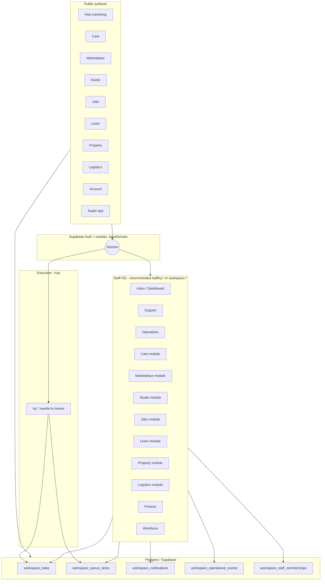
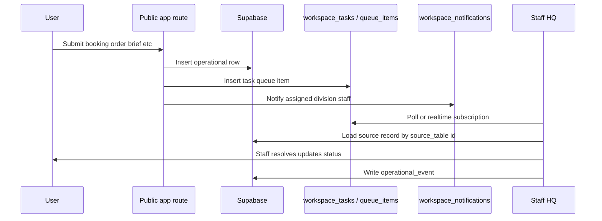
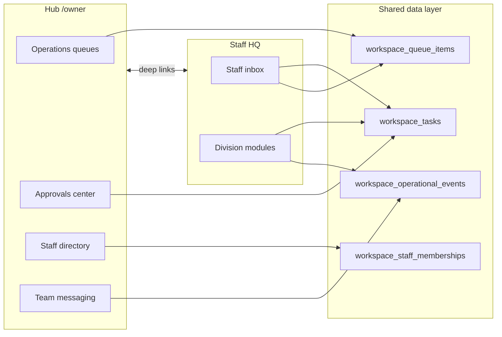

# HenryCo Staff Platform — Masterplan (Grounded)

**Status:** Architecture / planning — not an implementation PR.  
**Audience:** Workforce platform, internal ops, engineering leads.  
**Last updated:** 2026-04-05  
**Companion docs:** [HENRYCO_ROLE_WORKFLOW_MATRIX.md](./HENRYCO_ROLE_WORKFLOW_MATRIX.md), [HENRYCO_PUBLIC_TO_INTERNAL_MAP.md](./HENRYCO_PUBLIC_TO_INTERNAL_MAP.md), [staff-hq-architecture.md](./staff-hq-architecture.md) (earlier draft; this document supersedes for naming and mandatory sections).

---

## 1. Executive truth summary

1. **HenryCo already has a first-class executive surface:** Hub `hq.*` → `/owner/*` with rich navigation (`owner-navigation.ts`) covering operations, finance, workforce, messaging, brand, AI, audit.

2. **Cross-division staff data primitives already exist in Supabase (hub migrations):** `workspace_staff_memberships`, `workspace_division_memberships`, `workspace_tasks`, `workspace_queue_items`, `workspace_notifications`, `workspace_operational_events`, `workspace_internal_notes`, `workspace_preferences`, `workspace_helper_signals`, `workspace_module_registry`. These are the **correct backbone** for a unified staff platform.

3. **The canonical permission vocabulary already exists in code:** `PlatformRoleFamily`, `WorkspacePermission`, `DIVISION_ROLE_CATALOG`, and `PERMISSIONS_BY_FAMILY` in `apps/hub/app/lib/workspace/*` — not yet consumed by a live staff UI on `workspace.*` (that route shows `StaffSurfaceRetired`).

4. **Operational staff UIs are fragmented:** Live consoles exist inside **studio** (sales/pm/delivery/finance/support), **learn** (`/admin`, `/analytics`), **marketplace** (`/admin`), **property** (`/admin`). **Care** `/admin` is a **placeholder without server auth**. **Jobs** recruiter/staff paths are **retired**. **Logistics** has **no admin**; bookings write DB + customer notify **without** mirrored ops alert in reviewed code.

5. **Auth is per-app** with shared Supabase cookies (`getSharedCookieDomain` in `@henryco/config`) — favorable for **one staff subdomain** with one Next deployment, harder for many staff subdomains without duplication.

6. **Recommended strategic choice:** **Option C (hybrid)** — **one master Staff HQ** (`staffhq.henrycogroup.com` or revival of `workspace.*` with real product) as the **default**; **optional** dedicated subdomains **only** after measured need (isolation, scale, compliance). This matches the codebase (shared auth, existing `workspace_*` schema, retired `workspace` UI) better than premature `carehq`, `marketplacehq`, etc.

---

## 2. Internal surface inventory

| Name | App | Route / host | Target role(s) | Purpose | Maturity | Status | Extend vs replace | vs Owner HQ | vs Public |
|------|-----|--------------|----------------|---------|----------|--------|-------------------|-------------|-----------|
| Executive Command Center | hub | `hq.*` → `/owner/*` | owner, admin | Strategy, approvals, staff invite, finance, brand, AI | High (many pages) | **Active** | **Extend** (deep links to staff) | — | Marketing on non-hq host |
| Workspace shell (legacy) | hub | `workspace.*` → `/workspace/*` | Intended staff | Unified workspace | **Retired UI** | `StaffSurfaceRetired` | **Replace** with real Staff HQ | Complement | — |
| Care admin shell | care | `/admin` | Intended: care admin | Control center copy | **Placeholder** | **No requireRoles on page** | **Secure then extend or redirect** | Owner sees division KPIs | Public site separate |
| Care staff routes | care | `(staff)/*` | owner, manager, rider, support, staff | Division ops | Retired | `StaffSurfaceRetired` | Replace with Staff HQ `/care` | — | — |
| Studio internal consoles | studio | `/sales`, `/pm`, `/delivery`, `/finance`, `/support`, `/project/[id]` | StudioRole set | Real workflows | **Active** | **Active** | **Gradually migrate** into Staff HQ module | Executive oversight | Client portal public |
| Learn admin | learn | `/admin`, `/analytics` | academy_owner, admin, finance… | Academy ops | **Active** | **Active** | Migrate to Staff HQ `/learn` | Owner alerts on teachers | Public courses |
| Marketplace admin | marketplace | `/admin`, `/admin/[resource]` | marketplace_admin, etc. | Catalog, ops | **Active** | **Active** | Migrate to Staff HQ `/marketplace` | Owner alerts | Public storefront |
| Property admin | property | `/admin` | property_admin, etc. | Listings ops | **Active** | **Active** | Migrate to Staff HQ `/property` | Lead alerts | Public listings |
| Jobs recruiter | jobs | `/recruiter/*` | recruiter | Hiring | Retired layout | `StaffSurfaceRetired` | Rebuild under Staff HQ `/jobs` | — | Public jobs |
| Jobs admin | jobs | `/admin` | — | Re-exports recruiter | Broken by layout | **Stale** | Fix or remove | — | — |
| Jobs moderation | jobs | `/moderation` | moderator | Moderation | Retired | `StaffSurfaceRetired` | Staff HQ | — | — |
| Marketplace owner/ops | marketplace | `/owner`, `/operations`, `/moderation` | owner, ops | Division staff | Retired | `StaffSurfaceRetired` | Staff HQ | — | — |
| Property ops/moderation | property | `/operations`, `/moderation`, `/owner` | ops | Division staff | Retired | `StaffSurfaceRetired` | Staff HQ | — | — |
| Learn owner | learn | `/owner/*` | owner | Academy owner | Retired | `StaffSurfaceRetired` | Staff HQ + hub | — | — |
| Studio owner | studio | `/owner` | owner | Division owner | Retired | `StaffSurfaceRetired` | Staff HQ + hub | — | — |
| Logistics catch-all | logistics | `[...slug]` unknown | — | — | Partial | Can show `StaffSurfaceRetired` | Staff HQ `/logistics` | — | Public booking |
| Account portal | account | `(account)/*` | customer (+ owner flags) | Wallet, support, prefs | **Active** | **Active** | Keep customer; staff uses Staff HQ | Owner uses hub | Entry for support threads |
| Super-app | super-app | Expo routes | End user | Mobile | Partial | **Active** | Contact → queue | — | — |

---

## 3. Role / permission map

See **[HENRYCO_ROLE_WORKFLOW_MATRIX.md](./HENRYCO_ROLE_WORKFLOW_MATRIX.md)** for the full matrix.

**Compressed truth:**

- **Executive:** `owner_profiles.role` ∈ {`owner`, `admin`} on hub.
- **Workspace model (hub):** `PlatformRoleFamily` + `WorkspacePermission` + per-division `DivisionRole` catalog — **use this** as the long-term source of truth for Staff HQ.
- **Vertical product roles:** Still required for **RLS** and **existing** `require*Roles` during migration; map them to hub division roles in `workspace_division_memberships.role`.

---

## 4. Database / workflow map

**Authoritative DDL sample inspected:** `apps/hub/supabase/migrations/20260402235500_workspace_staff_platform.sql`.

| Entity group | Tables (repo-confirmed) | Drives |
|--------------|-------------------------|--------|
| Staff identity | `workspace_staff_memberships`, `workspace_division_memberships` | Who can see which module |
| Work routing | `workspace_tasks`, `workspace_queue_items` | Queues, SLAs, assignment |
| Comms / audit | `workspace_notifications`, `workspace_operational_events`, `workspace_internal_notes` | Timeline, escalations |
| UX prefs | `workspace_preferences`, `workspace_module_registry`, `workspace_helper_signals` | Nav, AI helpers |
| HQ comms | `hq_internal_comm_*` | Owner/staff messaging |
| Division verticals | `care_*`, `marketplace_*`, `studio_*`, `learn_*`, `property_*`, `logistics_*`, jobs-related activity/support | Operational truth |
| Account / wallet | `customer_wallet_*`, `support_threads`, `customer_activity` | Cross-division |
| Staff audit | `staff_navigation_audit` (DDL); `staff_audit_logs` (code refs — verify on DB) | Compliance |

**Public → entity mapping:** see **[HENRYCO_PUBLIC_TO_INTERNAL_MAP.md](./HENRYCO_PUBLIC_TO_INTERNAL_MAP.md)**.

---

## 5. Public → internal connection map

Documented in detail in **HENRYCO_PUBLIC_TO_INTERNAL_MAP.md**. Staff HQ must subscribe to the same events (DB triggers, server actions, or explicit inserts) to populate `workspace_tasks` / `workspace_queue_items` for anything currently only sending email.

---

## 6. Owner HQ integration map

| Owner HQ area (`/owner/...`) | Staff HQ linkage |
|------------------------------|------------------|
| `/owner/operations/queues` | Same underlying `workspace_queue_items` / tasks — owner sees **aggregate**; staff sees **action** views |
| `/owner/operations/approvals` | Finance + policy approvals staffed by `finance_staff` / `division_manager`; owner sees **pending executive** slice |
| `/owner/staff`, `/owner/staff/invite`, `/owner/staff/roles` | Writes `workspace_*` memberships; Staff HQ **reads** same rows for gates |
| `/owner/messaging/team` | `hq_internal_comm_*`; staff client could embed or deep-link |
| `/owner/settings/audit` | Operational events + `staff_navigation_audit` correlation |
| `/owner/finance/*` | Same tables as account wallet / division finance — **no duplicate ledger** |

**Deep links:**

- Owner row → `https://staffhq.{base}/...?record=...` (task or entity)  
- Staff entity → `https://hq.{base}/owner/operations/queues?highlight=...` for escalations  

---

## 7. How many staff dashboards / workspaces?

### Recommended topology

**One deployed internal app** (or hub subtree **only if** team wants single deployable — prefer **`apps/staff` new Next app** for blast radius) containing **~12 top-level modules**, not 12 separate products:

| # | Module | Type | Primary users |
|---|--------|------|---------------|
| 1 | **Dashboard / Inbox** | Unified queue + KPIs | Everyone |
| 2 | **Support** | Cross-division tickets | Support families |
| 3 | **Operations** | Lane-based queues | Ops, coordinators |
| 4 | **Care** | Division console | Care roles |
| 5 | **Marketplace** | Division console | Marketplace roles |
| 6 | **Studio** | Division console | Studio roles |
| 7 | **Jobs** | Division console | Jobs roles |
| 8 | **Learn** | Division console | Learn roles |
| 9 | **Property** | Division console | Property roles |
| 10 | **Logistics** | Dispatch + shipments | Logistics roles |
| 11 | **Finance** | Approvals, payouts | Finance family |
| 12 | **Workforce** | Directory (scoped) | Managers, HR delegates |

**Counting rule:** This is **1 shell + 12 modules** (some role-gated), **not** 12 separate subdomains.

### Second-best topology

**Keep division admin only inside each app** (status quo + fix care auth). **Weaker because:** duplicated shell, inconsistent nav, harder cross-division support, `workspace_*` tables underused, owner queues drift from staff actions.

---

## 8. Domain / subdomain strategy

### Evaluation

| Option | Fit to repo | Verdict |
|--------|-------------|---------|
| **A — Unified `staffhq.{base}`** | Matches shared cookie, single RBAC evolution, `workspace_*` schema | **Preferred** |
| **B — Many `*hq.{base}`** | Multiplies Next deploys, auth callbacks, CORS, nav sync | **Reject for MVP** |
| **C — Hybrid** | Start A; add e.g. `logisticshq` only if compliance or team autonomy proven | **Adopt** |

### Existing hosts (hub `proxy.ts`)

- `hq.{base}` → `/owner` executive  
- `workspace.{base}` → `/workspace` (currently retired)  

**Implementation choices:**

1. **New `staffhq.*`** — clearest branding; add `proxy.ts` pattern or Vercel rewrite similar to hub.  
2. **Repurpose `workspace.*`** — less DNS churn; replace `StaffSurfaceRetired` with real app — **semantically ideal** if product name “workspace” is acceptable.

### Auth / session

- Same Supabase project; `getSharedCookieDomain()` already returns `.{baseDomain}` in production — **subdomains share session**.  
- Staff HQ uses **staff membership rows** for authorization, not a second IdP.

### Deployment

- One Vercel project for Staff HQ keeps env and build simple; vertical apps stay separate for public scaling.

---

## 9. Login redirect rules (precise)

**Inputs:** `workspace_staff_memberships`, `workspace_division_memberships`, `workspace_preferences.default_division`, hub mapping from `profiles.role` → `PlatformRoleFamily`, Care `homeForRole` during care-only login (legacy).

| Condition | Landing |
|-----------|---------|
| No staff membership row; not owner | Redirect to **account** or division **customer** home — **not** Staff HQ |
| `system_admin` or executive mapping | `/inbox` or `/operations` (config) + full nav |
| `finance_staff` only | `/finance` |
| `support_staff` / `coordinator` only | `/support` |
| Single division in memberships | `/{division}` (e.g. `/logistics`) |
| Multiple divisions, one `primary_division` on membership | `/{primary_division}` |
| Multiple divisions, no primary | `/inbox` + **division switcher** |
| `profiles.role === rider` (Care legacy) | `/care` dispatch-style view (maps to logistics + care divisions per `DEFAULT_HOME_DIVISIONS`) |
| **Owner** on `owner_profiles` accessing Staff HQ | Allow **if** also staff row **or** explicit policy; default owner session lands **`hq.*` `/owner`** not Staff HQ |
| **Multi-role** | **Unified inbox** default; optional `workspace_preferences.pinned_modules` for override |

**Implementation note:** Persist “last module” in `workspace_preferences` for return visits.

---

## 10. Productivity feature set (non-gimmick)

| Feature | Maps to existing schema / code |
|---------|--------------------------------|
| Universal command bar | New UI; actions call server mutations + navigate to `workspace_module_registry.route_path` |
| Cross-division search | Query across `source_table` + `source_id` on tasks, comms, operational_events |
| My work / team queue | `workspace_tasks`, `workspace_queue_items` filtered by assignee |
| SLA timers | `workspace_queue_items.sla_due_at`, `workspace_tasks.due_at` |
| Assignment | `assigned_staff_membership_id` columns |
| Escalation | `workspace_operational_events` severity + task status `blocked` / metadata |
| Priority / risk | `priority`, `workspace_helper_signals` |
| Internal notes | `workspace_internal_notes` |
| Attachments | `hq_internal_comm_attachments` + division-specific media tables |
| Activity timeline | `workspace_operational_events` + division audit where present |
| 360 view | Compose customer + division records by `customer_profiles` + foreign keys |
| Notifications | `workspace_notifications` (+ optional push later) |
| Approvals inbox | Filter tasks with `queue_key` matching approval types + owner mirror |
| Audit panel | `staff_navigation_audit`, operational events, marketplace audit logs |
| Bulk actions | Server actions with permission `division.write` or `division.approve` |

---

## 11. Shared internal foundation (packages)

Recommend **`@henryco/staff-shell`** (new package) or extend **`@henryco/ui`** with a **staff** export group — to avoid coupling staff to marketing `PublicShellLayout`.

| Primitive | Responsibility |
|-----------|----------------|
| `InternalShell` | Layout grid, density from `workspace_preferences` |
| `RoleAwareSidebar` | Driven by `workspace_module_registry` + viewer permissions |
| `InternalCommandBar` | `cmdk` + server search |
| `WorkQueuePanel` | `workspace_queue_items` lanes |
| `AssignmentPanel` | Reassign membership |
| `EscalationPanel` | Events + owner notify |
| `ActivityTimeline` | `workspace_operational_events` |
| `InternalRecordHeader` | Title, status badges, links to public + account |
| `StatusBadgeSystem` | Shared visual language with hub `StatusBadge` where possible |
| `PermissionsGate` | Client hint; **server must always re-check** |
| `StaffRouteGuard` | Server-only wrapper using hub workspace auth **extracted** to shared helper |
| `InternalSearch` | API route + Supabase |
| `InternalNotificationCenter` | `workspace_notifications` |
| `InternalEmptyState` / `InternalErrorState` | UX consistency |
| `InternalAuditTrail` | Aggregated queries |
| `InternalThemeGuard` | Align dark premium with owner + studio consoles |

---

## 12. Phased build plan

### Phase A — Foundation

- Extract **workspace viewer + permission check** from `apps/hub/app/lib/workspace/auth.ts` into a package callable from a new `apps/staff` (or temporary hub `/staff` routes behind feature flag).  
- Implement **StaffRouteGuard** + **InternalShell** skeleton.  
- Wire **login** (reuse account OAuth + redirect to staffhq).  
- Add **RLS policies** for `workspace_*` tables if missing on linked Supabase (verify with `supabase db diff` / dashboard).  
- **Fix Care `/admin`** with `requireRoles` or redirect to Staff HQ.

### Phase B — Queues + owner alignment

- Writers in public server actions insert **workspace_tasks** / **queue_items** (or Edge Function on insert).  
- Build **/inbox** and **/operations** reading real rows.  
- Hub `/owner/operations/queues` reads **same** API or shared query layer.  
- Close gaps: **logistics** ops notify, **super-app** contact queue.

### Phase C — Division depth + migration

- Embed or link existing **studio** consoles first (highest maturity).  
- Migrate **learn/marketplace/property** admin UIs behind Staff HQ routes.  
- Rebuild **jobs** recruiter/moderation.  
- **Polish:** SLA automation, bulk actions, mobile-friendly queue cards.

---

## 13. Risks, unknowns, legacy traps

| Risk | Mitigation |
|------|------------|
| RLS gaps on `workspace_*` | Audit policies before exposing to browser client |
| Tables used in code but DDL not in repo | Inventory `from("...")` + reconcile with remote schema |
| Two hosts (`hq` vs `staffhq`) confusing | Clear bookmark + redirect rules for owners |
| Care `/admin` open | Treat as **P0** security finding |
| `StaffSurfaceRetired` hiding real routes | Grep periodically; remove dead paths |
| Monorepo without `turbo.json` | CI already full sequential; consider Turborepo when adding `apps/staff` |

---

## 14. Files / modules inspected (this pass)

- `apps/hub/proxy.ts` — `hq.*`, `workspace.*` routing  
- `apps/hub/lib/owner-navigation.ts` — owner nav tree  
- `apps/hub/app/lib/workspace/types.ts` — divisions, roles, permissions, task types  
- `apps/hub/app/lib/workspace/roles.ts` — `PERMISSIONS_BY_FAMILY`, profile → family, defaults  
- `apps/hub/supabase/migrations/20260402235500_workspace_staff_platform.sql` — workspace tables  
- `apps/care/app/admin/page.tsx` — missing auth on admin shell  
- `apps/care/lib/auth/roles.ts` — `homeForRole`  
- `apps/jobs/app/admin/page.tsx` — recruiter re-export  
- `packages/config/company.ts` — `baseDomain`, divisions  
- `packages/ui/src/staff-surface-retired.tsx`  
- Repo-wide grep: `StaffSurfaceRetired` usage list  
- Cross-reference: prior audit of API routes and `HENRYCO_PUBLIC_TO_INTERNAL_MAP.md` sources  

---

## 15. Recommendations for the next build pass

1. **Decision:** Implement **Staff HQ as new Next app** `apps/staff` on `staffhq.{base}` **or** replace `workspace.*` retired page with production router — pick one and document in `deploy-checklist.md`.  
2. **Single permission engine:** Server-side only, sourced from hub workspace types; deprecate duplicate Care path checks **after** migration.  
3. **Use existing tables** before inventing new queue schemas.  
4. **Owner/staff unity:** One query module for queues consumed by hub owner pages and staff app.  
5. **Do not** add division-specific staff subdomains until Phase C review gates are met.

---

## Diagram 1 — Staff platform topology



---

## Diagram 2 — Role → workspace routing

```mermaid
flowchart LR
  subgraph inputs["Inputs"]
    OP[owner_profiles]
    PR[profiles.role]
    WM[workspace_staff_memberships]
    WD[workspace_division_memberships]
  end

  subgraph derive["Derive"]
    VF[PlatformRoleFamily set]
    PERM[WorkspacePermission set]
    DIV[Allowed divisions]
  end

  subgraph landing["Staff HQ landing"]
    INB[ /inbox ]
    FIN[ /finance ]
    SUP[ /support ]
    DIVR[ /{division} ]
  end

  OP -->|owner admin| HQONLY[hq /owner default]
  WM --> VF
  WD --> DIV
  PR --> VF
  VF --> PERM
  PERM --> landing
  DIV --> landing
  VF -->|finance_staff| FIN
  VF -->|support_staff coordinator| SUP
  DIV -->|single division| DIVR
  DIV -->|multi| INB
```

---

## Diagram 3 — Public → internal handoff



---

## Diagram 4 — Owner HQ ↔ Staff integration


