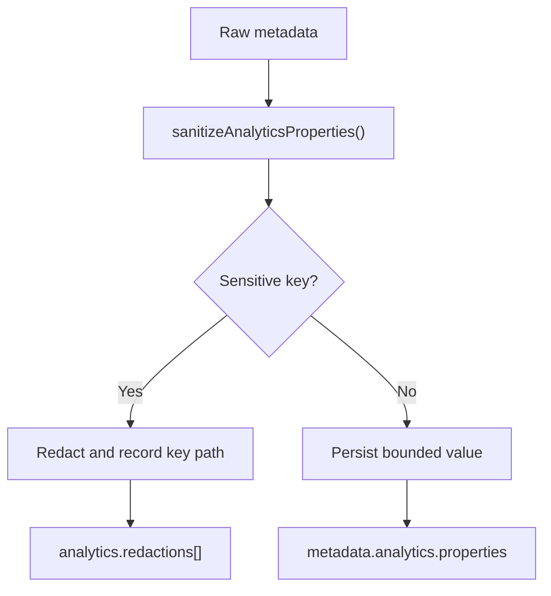

# HenryCo Analytics Data Boundaries

This document defines what may and may not enter the canonical analytics payload.

## Primary storage truth

- Primary authenticated analytics substrate: `customer_activity`
- Canonical payload location: `customer_activity.metadata.analytics`
- Marketplace supplement: `marketplace_events.payload.analytics`
- Owner reporting surface: `/owner/operations/analytics`

## Data minimization rules

The canonical analytics builder sanitizes payload properties before persistence.

Redaction pattern categories:

- identity and contact:
  - email
  - phone
  - address
  - location
- message content:
  - message
  - body
  - note
  - reviewer notes
- credentials and secrets:
  - token
  - secret
  - password
  - otp
  - pin
- files and proofs:
  - document
  - file
  - attachment
  - proof
  - public_id
  - url
- finance-sensitive account fields:
  - bank name
  - account name
  - account number
  - payout reference
- device/network identifiers:
  - IP
  - user agent

## Allowed payload shapes

- booleans
- numbers
- short strings
- shallow objects
- bounded arrays
- entity references
- status and outcome context
- non-secret correlation data

## Disallowed patterns

- raw customer support messages
- raw verification document identifiers or URLs
- raw bank account details
- auth secrets
- unbounded nested payload dumps
- provider secrets in client-visible bundles

## Client and server boundary

- Canonical event building for shared truth happens on the server before persistence.
- Client code may trigger workflows, but canonical owner reporting should depend on server-persisted activity truth.
- No server analytics secret should be exposed through `NEXT_PUBLIC_*` env usage.
- Sentry or notification-provider correlation should remain additive, not a replacement for internal event truth.

## Current truth statements

- `CONFIRMED TRUE`: sensitive keys are redacted before canonical analytics properties are persisted
- `CONFIRMED TRUE`: owner reporting reads normalized canonical activity rows rather than raw provider dashboards
- `PARTIALLY TRUE`: notification attribution is visible as notification-linked events, but not yet stitched into a universal campaign-to-completion graph
- `DEFER WITH EXPLICIT REASON`: anonymous public browsing telemetry was not centralized in this pass because it would require cross-app public instrumentation beyond the authenticated event layer
