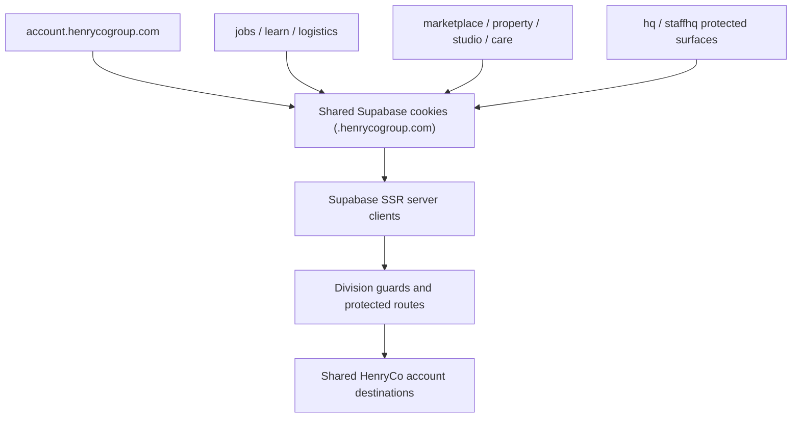

# HenryCo Auth Continuity Map

This file maps how one HenryCo account now travels across divisions.

## Continuity Rules

- Shared session cookies are scoped through `packages/config/company.ts` and `packages/config/supabase-cookies.ts`.
- Shared-domain cookie writes are forced through `buildSharedCookieWriteOptions()` and `buildSharedCookieHandlers()`.
- Browser Supabase clients use shared cookie-domain options where the host resolves to a HenryCo production domain.
- Proxies now normalize Supabase cookie writes across:
  - `apps/account`
  - `apps/care`
  - `apps/jobs`
  - `apps/learn`
  - `apps/logistics`
  - `apps/marketplace`
  - `apps/property`
  - `apps/studio`
- Care callback routes and HQ workspace/owner server auth now use the same shared cookie-domain resolution path.

## Canonical Entry Points

- `CONFIRMED TRUE`: shared sign-in and sign-up entry is `account.henrycogroup.com`.
- `CONFIRMED TRUE`: Jobs, Learn, Logistics, Marketplace, Studio, Care, HQ, and StaffHQ route into the shared account surface for auth entry.
- `MUST FIX NOW` resolved in this pass: Property no longer points users at stale local `/login` paths; it now builds shared account login URLs everywhere.

## Logout Truth

- Logout routes in every division now call `supabase.auth.signOut({ scope: "global" })`.
- Account logout security events explicitly record `scope = global`.
- `CONFIRMED TRUE`: user-initiated sign-out is now code-explicitly global across HenryCo sessions, not only implied by library defaults.

## Inspectable Surfaces

- Account auth callback: `apps/account/app/auth/callback/route.ts`
- Shared cookie logic: `packages/config/supabase-cookies.ts`
- Per-division auth proxies: `apps/*/proxy.ts`
- Property shared-account entry helpers: `apps/property/lib/property/links.ts`
- Global session control UI: `apps/account/components/security/GlobalSignOutCard.tsx`

## Known Limits

- `PARTIALLY TRUE`: recent device and session activity is inspectable through security events, not a dedicated live session inventory.
- `DEPLOYMENT-BLOCKED`: true cross-app live verification still requires authenticated browser checks on production domains after deployment.
