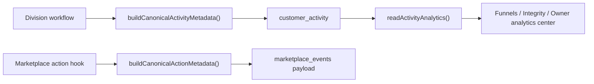

# HenryCo Event Taxonomy

This document defines the shared analytics contract implemented in [`packages/intelligence/src/analytics.ts`](../packages/intelligence/src/analytics.ts).

## Naming standard

- Canonical name format: `henry.<domain>.<entity>.<verb>`
- Classification:
  - `user_action`: an actor did something
  - `system_state`: the platform changed state or resolved a workflow
- Outcome values:
  - `started`, `completed`, `saved`, `submitted`, `requested`, `updated`, `removed`
  - `approved`, `rejected`, `blocked`, `failed`, `pending`
  - `paid`, `verified`, `resolved`, `delivered`, `issued`

## Source-of-truth model

- Primary authenticated event truth: `customer_activity`
- Shared metadata builder: `buildCanonicalActivityMetadata(...)`
- Marketplace action supplement: `buildCanonicalActionMetadata(...)`
- Primary owner/operator reporting reader: `readActivityAnalytics(...)`
- Canonical analytics payload fields:
  - `analytics.canonicalName`
  - `analytics.classification`
  - `analytics.outcome`
  - `analytics.funnelKey`
  - `analytics.funnelStep`
  - `analytics.touches`
  - `analytics.experimentSafe`

## Event families

| Division | Activity types | Canonical names |
|---|---|---|
| `account` | `account_created`, `support_created`, `support_replied`, `notification_read`, `notification_unread`, `notification_archive`, `verification_submitted`, `verification_resolved` | `henry.auth.account.created`, `henry.support.thread.created`, `henry.support.thread.replied`, `henry.account.notification.read`, `henry.account.notification.unread`, `henry.account.notification.archived`, `henry.trust.verification.submitted`, `henry.trust.verification.resolved` |
| `wallet` | `wallet_funding_requested`, `wallet_funding_proof_uploaded`, `wallet_withdrawal_requested`, `wallet_withdrawal_blocked` | `henry.wallet.funding.requested`, `henry.wallet.funding.proof_uploaded`, `henry.wallet.withdrawal.requested`, `henry.wallet.withdrawal.blocked` |
| `marketplace` | `cart_item_added`, `wishlist_added`, `wishlist_removed`, `vendor_followed`, `vendor_unfollowed`, `checkout_started`, `order_placed`, `payment_verified`, `order_confirmed`, `order_packed`, `order_shipped`, `order_delivered`, `order_delayed`, `vendor_application_submitted`, `vendor_application_approved`, `vendor_application_rejected`, `vendor_application_changes_requested`, `payout_requested`, `dispute_opened`, `dispute_updated`, `dispute_resolved` | `henry.marketplace.cart.updated`, `henry.marketplace.wishlist.updated`, `henry.marketplace.vendor.follow_updated`, `henry.marketplace.checkout.started`, `henry.marketplace.order.placed`, `henry.marketplace.payment.verified`, `henry.marketplace.order.confirmed`, `henry.marketplace.order.packed`, `henry.marketplace.order.shipped`, `henry.marketplace.order.delivered`, `henry.marketplace.order.delayed`, `henry.marketplace.vendor_application.submitted`, `henry.marketplace.vendor_application.resolved`, `henry.marketplace.payout.requested`, `henry.marketplace.dispute.opened`, `henry.marketplace.dispute.updated`, `henry.marketplace.dispute.resolved` |
| `care` | `care_booking` | `henry.care.booking.updated` |
| `jobs` | `jobs_candidate_profile`, `jobs_saved_post`, `jobs_application`, `jobs_employer_verification` | `henry.jobs.profile.updated`, `henry.jobs.role.saved`, `henry.jobs.application.updated`, `henry.jobs.employer.verification_updated` |
| `learn` | `learn_enrollment_created`, `learn_payment_confirmed`, `learn_lesson_completed`, `learn_certificate_issued`, `learn_support_thread_created` | `henry.learn.enrollment.created`, `henry.learn.payment.confirmed`, `henry.learn.progress.lesson_completed`, `henry.learn.certificate.issued`, `henry.learn.support.thread.created` |
| `logistics` | `logistics_quote`, `logistics_booking` | `henry.logistics.quote.requested`, `henry.logistics.booking.created` |
| `property` | `property_saved`, `property_unsaved`, `property_inquiry`, `property_viewing_requested`, `property_listing_submitted`, `property_listing_updated`, `property_listing_reviewed` | `henry.property.listing.saved`, `henry.property.listing.unsaved`, `henry.property.listing.inquiry_submitted`, `henry.property.listing.viewing_requested`, `henry.property.listing.submitted`, `henry.property.listing.updated`, `henry.property.listing.reviewed` |
| `studio` | `studio_lead_submitted`, `studio_proposal_ready`, `studio_payment_updated`, `studio_project_updated`, `studio_message_added` | `henry.studio.lead.submitted`, `henry.studio.proposal.ready`, `henry.studio.payment.updated`, `henry.studio.project.updated`, `henry.studio.message.added` |

## Rules

- User actions and system state changes must not share ad hoc names.
- Success, blocked, failed, and pending states must remain distinguishable in `analytics.outcome`.
- `customer_activity.metadata.analytics` is the canonical structured payload.
- `intel:henry.*` activity types are treated as canonical system-state events, not as a separate analytics dialect.
- Marketplace action logging may continue to write audit rows, but owner reporting should prefer canonical activity truth whenever the shared projection exists.

## Dynamic descriptor behavior

- `jobs_application` changes funnel step from `job_applied` to `application_progressed` when status moves beyond `applied`.
- `care_booking` changes funnel step by booking status:
  - `requested` -> `booking_requested`
  - active/confirmed states -> `booking_confirmed`
  - `completed` or `delivered` -> `booking_completed`
- `wallet_withdrawal_blocked` is explicitly marked `experimentSafe: false`.

## Governance intent

- Do not hand-roll event names in division pages or routes.
- Emit through the shared builders before writing activity payloads.
- Extend the taxonomy centrally in `packages/intelligence` before adding new conversion-critical events.
