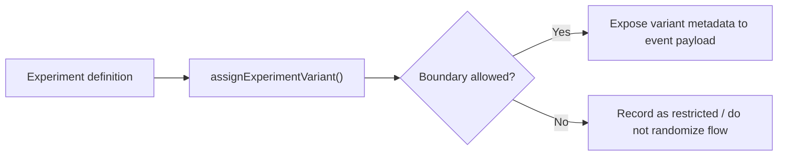

# HenryCo Experiment Readiness Model

This document defines the experimentation contract implemented in [`packages/intelligence/src/analytics.ts`](../packages/intelligence/src/analytics.ts).

## Principles

- Deterministic assignment only.
- No uncontrolled randomness in production flows.
- Evaluation must be backed by canonical event truth.
- High-risk workflows stay outside experimentation unless a separate guarded program exists.

## Assignment model

- Function: `assignExperimentVariant(definition, subjectKey)`
- Hashing method: deterministic `fnv1a`
- Assignment record:
  - `key`
  - `boundary`
  - `variant`
  - `bucket`
  - `allowed`
- Audit payload helper: `buildExperimentAuditMetadata(...)`

## Boundaries

| Boundary | Allowed | Meaning |
|---|---|---|
| `safe_ui` | Yes | presentation, hierarchy, layout emphasis |
| `content` | Yes | copy, helper text, messaging angle |
| `navigation` | Yes | wayfinding and discovery improvements |
| `operator_reporting` | Yes | owner/operator dashboard presentation |
| `non_financial_ranking` | Yes | sorting or ranking that does not change trust, support, or money movement truth |
| `high_risk` | No | auth, support lifecycle, trust/KYC, finance, payouts, wallet settlement |

## Readiness rules

A row is considered safe for experimentation only when all of the following are true:

- `analytics.experimentSafe === true`
- `analytics.touches.finance === false`
- `analytics.touches.trust === false`
- `analytics.touches.support === false`

A row is treated as restricted when any of the following are true:

- `analytics.experimentSafe === false`
- finance-sensitive
- trust-sensitive
- support-sensitive

## What is explicitly out of bounds in this pass

- support thread lifecycle backend mutations
- trust verification adjudication behavior
- wallet funding settlement logic
- wallet withdrawal approval/settlement logic
- invoice settlement truth
- payout approval truth

## Evaluation expectations

- Use canonical funnel steps and outcomes for experiment readouts.
- Do not compare variants using raw pageview counts alone.
- Do not call a variant successful if it lifts clicks but increases blocked, failed, rejected, or support-linked outcomes.
- Owner reporting should show both:
  - safe rows available for experiments
  - restricted rows that must not be randomized

## Current repo status

- `CONFIRMED TRUE`: deterministic assignment helpers exist
- `CONFIRMED TRUE`: owner analytics center shows safe vs restricted experiment slices
- `PARTIALLY TRUE`: no shared persistence table exists yet for long-lived experiment enrollment history
- `DEFER WITH EXPLICIT REASON`: backend enrollment persistence was not added in this pass to avoid destabilizing high-risk or shared support work
