# HenryCo Funnel Model Map

This document describes the funnel keys implemented in [`packages/intelligence/src/analytics.ts`](../packages/intelligence/src/analytics.ts) and surfaced in the owner analytics center.

## Funnel inventory

| Funnel key | Division | Steps | Current truth status |
|---|---|---|---|
| `visitor_to_account` | `account` | `account_created` -> `verification_submitted` -> `verification_resolved` | `PARTIALLY TRUE`: starts at account creation because anonymous pre-auth visitor events are not yet canonicalized across public apps |
| `verification_completion` | `account` | `verification_submitted` -> `verification_resolved` | `CONFIRMED TRUE` |
| `marketplace_purchase` | `marketplace` | `cart_add` -> `wishlist_update` -> `checkout_started` -> `order_placed` -> `order_paid` -> `order_fulfillment` | `CONFIRMED TRUE` for authenticated shared activity rows and canonical marketplace action projections |
| `care_booking` | `care` | `booking_requested` -> `booking_confirmed` -> `booking_completed` | `CONFIRMED TRUE` |
| `learn_enrollment` | `learn` | `course_enrolled` -> `payment_confirmed` -> `certificate_issued` | `CONFIRMED TRUE` |
| `jobs_application` | `jobs` | `job_saved` -> `job_applied` -> `application_progressed` | `CONFIRMED TRUE` |
| `property_inquiry` | `property` | `listing_saved` -> `listing_inquired` -> `viewing_requested` | `CONFIRMED TRUE` |
| `property_submission` | `property` | `listing_submitted` -> `listing_reviewed` | `CONFIRMED TRUE` |
| `studio_lead` | `studio` | `lead_submitted` -> `proposal_ready` -> `project_paid` | `CONFIRMED TRUE` |
| `logistics_booking` | `logistics` | `quote_requested` -> `shipment_booked` | `CONFIRMED TRUE` |
| `wallet_funding` | `wallet` | `wallet_funding_requested` -> `wallet_proof_uploaded` | `CONFIRMED TRUE` |
| `wallet_withdrawal` | `wallet` | `wallet_withdrawal_requested` | `CONFIRMED TRUE` for request and trust-block visibility; settlement completion is still external to this funnel definition |
| `support_recovery` | `account` and `learn` support-linked flows | `support_created` -> `support_replied` | `CONFIRMED TRUE` for customer-side thread creation and reply activity |

## Funnel semantics

- Participant identity:
  - first preference: `user_id`
  - fallback: `reference_id`
  - final fallback: row `id`
- Step counts are de-duplicated by participant within each step.
- Bottleneck is the largest step-to-step drop within the current sample.
- Step diagnostics also retain:
  - `blocked`
  - `failed`
  - `pending`

```mermaid
flowchart TD
  A["Canonical activity row"] --> B["readActivityAnalytics()"]
  B --> C["analytics.funnelKey"]
  B --> D["analytics.funnelStep"]
  C --> E["summarizeFunnels()"]
  D --> E
  E --> F["Owner analytics center"]
  E --> G["Division conversion review"]
```

## Correlated but not yet first-class funnels

| Journey | Status | Reason |
|---|---|---|
| `notification -> action completion` | `PARTIALLY TRUE` | notification lifecycle rows are canonicalized, but downstream completion events are not yet consistently stitched to notification identifiers across all divisions |
| `visitor -> anonymous browse -> account creation` | `PARTIALLY TRUE` | public anonymous browse/view/search events are not yet standardized into the shared internal model |
| `support friction -> recovery or drop-off` | `CONFIRMED TRUE` at thread level, `PARTIALLY TRUE` for end-to-end resolution attribution | customer-side thread creation and reply are canonicalized; full resolution attribution still depends on backend support lifecycle work reserved for another pass |

## Owner reporting implications

- Conversion reporting should use funnel summaries, not raw activity counts.
- A funnel with zero rows in the current owner sample is not automatically a missing implementation.
- Coverage gaps must be interpreted with both conditions in mind:
  - missing instrumentation
  - no recent traffic in sample

## Next extension points

- Add canonical anonymous browse/search/view events if public acquisition truth becomes a product priority.
- Thread notification correlation IDs through action completion events before claiming campaign-to-conversion truth.
- Add explicit post-withdrawal settlement and payout completion states if finance operations need a deeper wallet settlement funnel.
