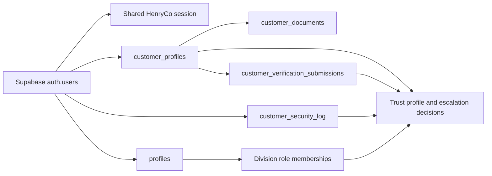

# HenryCo Identity State Model

This document records the current repo-truth identity model after the identity/auth hard pass.

## Source Of Truth

- `auth.users` in Supabase is the credential and session authority.
- `customer_profiles` is the customer-facing identity profile and trust state record.
- `profiles` carries shared staff or legacy role metadata.
- Division membership tables such as `property_role_memberships`, `marketplace_role_memberships`, `learn_role_memberships`, and `logistics_role_memberships` define division-scoped elevated access.
- `customer_documents` stores uploaded evidence.
- `customer_verification_submissions` and `customer_profiles.verification_*` hold document-review identity verification state.
- `customer_security_log` holds sign-in, sign-out, suspicious access, and device/location-derived security activity.

## Live Identity Signals

- `CONFIRMED TRUE`: email verification is real and read from `auth.users.email_confirmed_at`.
- `CONFIRMED TRUE`: document identity verification is real and read from `customer_profiles.verification_status` plus `customer_verification_submissions`.
- `PARTIALLY TRUE`: phone is stored and normalized, but phone OTP verification is not wired as a separately enforced verified state.
- `CONFIRMED TRUE`: duplicate-contact review is real via `apps/account/lib/contact-review.ts`.
- `CONFIRMED TRUE`: suspicious access visibility is real via `apps/account/lib/security-events.ts` and `customer_security_log`.
- `PARTIALLY TRUE`: recent device/session activity is visible through security events, not a dedicated live session table.
- `FALSE / STALE`: MFA, passkeys, and authenticator-app enforcement are not live in repo truth.

## Shared Trust And Escalation Signals

- `emailVerified`: email ownership verified in Supabase Auth.
- `identityVerified`: `customer_profiles.verification_status = verified`.
- `phonePresent`: normalized phone exists on the account.
- `profileCompletion`: weighted customer profile completeness.
- `accountAgeDays`: derived from `auth.users.created_at`.
- `settledTransactions`: completed wallet or verified transaction history.
- `suspiciousEvents`: high-risk or failed security events.
- `duplicateEmailMatches` / `duplicatePhoneMatches`: overlap review counts from `customer_profiles`.

## Current Escalation Flags

- `jobsPostingEligible`: non-basic trust, verified email, and phone or document identity proof.
- `marketplaceEligible`: document identity verified, trusted tier, and no active overlap review.
- `instructorEligible`: non-basic trust, verified email, and no active overlap review.
- `propertyPublishingEligible`: non-basic trust plus phone or document identity proof.
- `payoutEligible`: document identity verified, trusted tier, clean recent security posture, and no active overlap review.
- `staffElevationEligible`: premium verified trust, document identity verified, and clean recent security posture.

## Explicit Deferrals

- `DEFER WITH EXPLICIT REASON`: phone OTP verification is not enforced because no complete Twilio-backed verification flow is wired across repo truth.
- `DEFER WITH EXPLICIT REASON`: passkeys and MFA remain non-live because no enrollment, challenge, recovery, or enforcement path exists in the repo.
- `DEFER WITH EXPLICIT REASON`: per-device live session revocation remains unavailable because the current repo exposes global sign-out and security activity, not separate session records with individual revoke controls.
