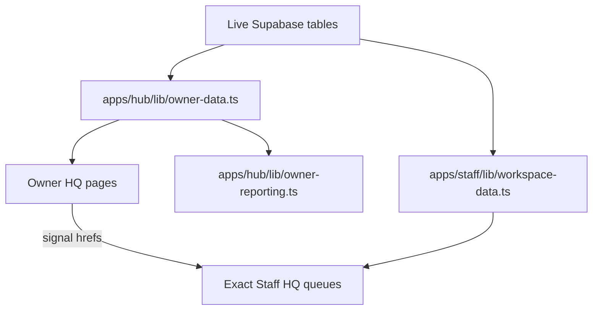

# Owner Oversight Model

This document describes how owner-facing oversight is now generated, routed, and escalated across `apps/hub` and `apps/staff`.

## Deterministic Signal Families

| Signal family | Current rule | Owner surface | Drill-down target |
| --- | --- | --- | --- |
| Support pressure | open/stale/high-priority `support_threads` | owner overview, operations, division summaries | Staff HQ support desk |
| Queue neglect | unread `customer_notifications` by division | owner overview and operations rollups | Staff HQ operations queue or division queue |
| Governance risk | repeated `staff.update` actions in `staff_audit_logs` | owner overview, workforce, settings control | Staff HQ workforce/settings plus owner audit |
| Delivery failures | failed/skipped queue rows and `jobs_email_failed` audit events | owner overview, messaging, operations | Staff HQ division failure queue |
| Finance pressure | pending invoices, payout requests, overdue care bookings | owner overview, finance, AI briefings | Staff HQ finance or division queues |
| Studio commercial blockage | pending-deposit `customer_activity` rows | owner overview, division pressure | Staff HQ studio deposit-control queue |

## Routing Policy

1. Owner cards should not stop on vanity summaries when a Staff HQ queue already exists.
2. `apps/hub/lib/owner-data.ts` now emits Staff HQ drill-down URLs for support, care overdue bookings, marketplace onboarding/payouts, studio deposit control, property review, workforce onboarding, and delivery failures.
3. Owner AI helper insights reuse the same signal hrefs so escalation advice and click targets do not diverge.
4. Owner reporting still summarizes from live rows, but the operational drill-down path is the Staff HQ queue where possible.

## Current Application Surfaces

| App file | Responsibility |
| --- | --- |
| `apps/hub/lib/owner-data.ts` | live owner overview, division pressure, signals, finance and messaging rollups |
| `apps/hub/lib/owner-reporting.ts` | weekly/monthly owner summary generation and dispatch |
| `apps/staff/lib/workspace-data.ts` | queue-backed division, operations, finance, workforce, settings, and dashboard data |
| `apps/staff/lib/support-desk.ts` | shared support desk snapshot and server-side mutations |

## Escalation Thresholds In Use

- Stale support: `12+` hours without movement.
- Governance churn: `3+` recent `staff.update` events by the same actor, with `5+` treated as critical.
- Care overdue: booking date earlier than today while still operationally open.
- Delivery failures: failed/skipped queue rows or repeated jobs quota failures.
- Workforce onboarding drift: auth-backed accounts with no first sign-in.

## Known Oversight Gaps

- Wallet funding/withdrawal review still resolves to owner finance because Staff HQ has no wallet queue yet.
- Logistics dispatch oversight remains partial until dedicated shipment/dispatch state exists.
- Owner reports summarize the right truths today, but deeper queue-level rollup tables and escalation ledgers still need the dedicated Supabase pass.
