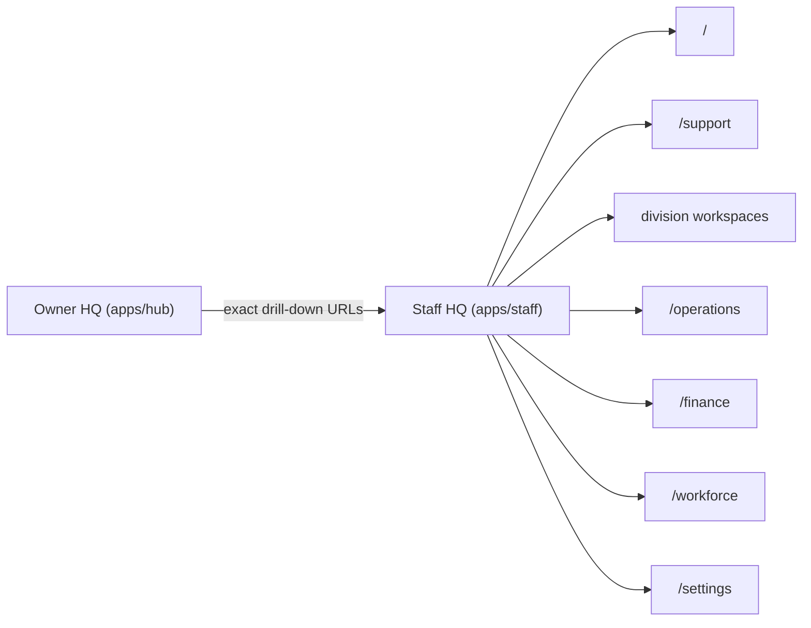

# Staff Route Map

This document maps the live `apps/staff` workspace surfaces to their queue models, data sources, and workflow drill-downs.

## Route Inventory

| Route | Primary queues | Live data sources | Typical actions / drill-downs |
| --- | --- | --- | --- |
| `/` | mixed top-priority records from visible divisions plus cross-division alerts | all workspace datasets through `apps/staff/lib/workspace-data.ts` | open exact queue item, jump to source workflow, pivot into division workspace |
| `/support` | mailbox/status filtered threads | `support_threads`, `support_messages`, `profiles`, auth users | mark viewed, assign to self, clear assignment, update priority, update status, reply |
| `/care` | `overdue-bookings`, `payment-recovery`, `booking-control`, `support-escalations` | `care_bookings`, `support_threads` | booking rail, manager operations, support lane |
| `/marketplace` | `vendor-review`, `disputes`, `marketplace-payouts`, `delivery-failures` | `marketplace_vendor_applications`, `marketplace_disputes`, `marketplace_payout_requests`, `marketplace_notification_queue` | seller review, dispute queue, payout review, notification queue |
| `/studio` | `project-delivery`, `lead-qualification`, `deposit-control`, `payment-failures` | `studio_projects`, `studio_leads`, `customer_activity`, `customer_notifications` | project workspace, PM board, sales leads, finance invoices |
| `/jobs` | `delivery-failures`, `unread-alerts`, `support-escalations` | `audit_logs`, `customer_notifications`, `support_threads` | recruiter pipeline, moderation, candidate review, support desk |
| `/learn` | `pending-invoices`, `instructor-review`, `support-escalations` | `customer_invoices`, `customer_notifications`, `support_threads` | instructor approvals, academy owner route, learner support |
| `/property` | `listing-review`, `inquiries`, `support-escalations` | `customer_notifications`, `customer_activity`, `support_threads` | moderation, property operations, owner route |
| `/logistics` | `support-escalations` or `dispatch-gaps` fallback | `support_threads` only in current repo truth | shared support desk, tracking route |
| `/operations` | `sla-watch`, `queue-neglect`, `governance-risk`, `delivery-failures` | `support_threads`, `customer_notifications`, `staff_audit_logs`, queue failure tables, audit logs | support desk, division queues, owner governance routes |
| `/finance` | `pending-invoices`, `marketplace-payouts`, `disputes`, `payment-recovery`, `delivery-failures` | division queues from care/marketplace/learn/studio | division finance surfaces and payout/invoice lanes |
| `/workforce` | `pending-onboarding`, `role-coverage`, `governance-risk` | auth users, role membership tables, `staff_audit_logs` | workforce controls, owner staff governance, audit history |
| `/settings` | `delivery-failures`, `governance-risk`, `audit-watch` | queue failure tables, `audit_logs`, `staff_audit_logs` | owner audit trail, workforce controls, comms recovery lanes |

## Shared Route Conventions

- Queue filtering uses `?queue=<queue-id>`.
- Workspace detail selection uses `?record=<record-id>`.
- Support detail selection uses `?thread=<thread-id>`.
- Search uses `?q=<term>`.
- Support desk mailbox/status filters use `?mailbox=` and `?status=`.

## Current Gaps

- Logistics has no dedicated dispatch queue in repo truth, so the fallback record openly documents the missing backend instead of faking one.
- Wallet funding and wallet withdrawal review still resolve inside owner finance surfaces rather than Staff HQ because no dedicated staff queue currently exists for those rows.
- Shared internal notes and explicit escalation objects are not yet persisted; those requirements are listed in `docs/ops-supabase-handoff.md`.
